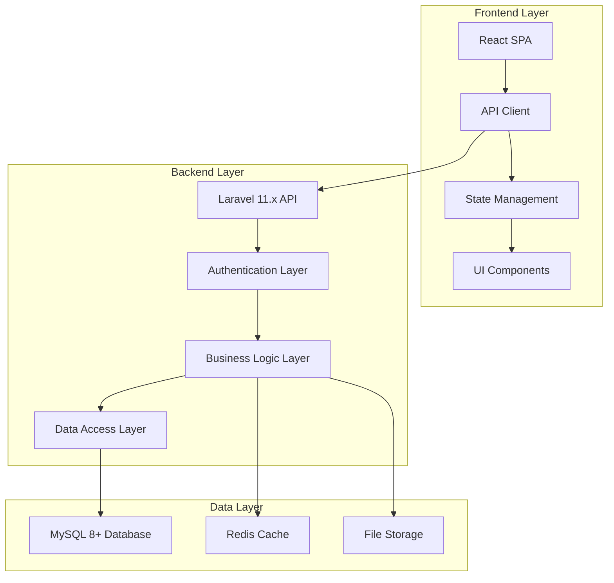

# Design Document: DrealtiesFX Academy

## Overview

DrealtiesFX Academy is a cohort-based learning management system built with a React frontend and Laravel 11.x backend. The system implements a gamified learning experience through a "Dreal Coin" reward system and enforces sequential progression through weekly content gates. The architecture follows a state-driven approach where all business logic resides in the backend, with the frontend serving as a presentation layer that consumes RESTful APIs.

The platform supports three primary user roles (Administrator, Instructor, Student) and manages structured 8-week learning cohorts containing lessons, topics, quizzes, assignments, and live classes. Progress tracking and gamification elements provide real-time feedback and motivation to maintain student engagement throughout the learning journey.

## Architecture

### System Architecture

The system follows a decoupled architecture pattern with clear separation between frontend presentation and backend business logic:



### Technology Stack

**Frontend:**
- React 18+ with functional components and hooks
- React Query for API state management and caching
- React Router for navigation
- Tailwind CSS for styling
- Framer Motion for animations and gamification effects

**Backend:**
- Laravel 11.x framework
- Laravel Sanctum for API authentication
- MySQL 8+ for primary data storage
- Redis for caching and session management
- Laravel Queues for background processing

**Infrastructure:**
- RESTful API design following OpenAPI 3.0 specification
- Token-based authentication with refresh token rotation
- Comprehensive caching strategy with cache invalidation
- Background job processing for notifications and heavy operations

## Components and Interfaces

### Core Domain Models

#### User Management
```php
// User model with role-based access
class User extends Authenticatable
{
    protected $fillable = ['name', 'email', 'role'];
    
    public function cohorts(): BelongsToMany;
    public function progress(): HasMany;
    public function coinTransactions(): HasMany;
}

// Role enumeration
enum UserRole: string
{
    case ADMINISTRATOR = 'administrator';
    case INSTRUCTOR = 'instructor';
    case STUDENT = 'student';
}
```

#### Cohort Structure
```php
class Cohort extends Model
{
    protected $fillable = ['name', 'description', 'start_date', 'capacity', 'status'];
    
    public function weeks(): HasMany;
    public function students(): BelongsToMany;
    public function instructors(): BelongsToMany;
}

class Week extends Model
{
    protected $fillable = ['cohort_id', 'week_number', 'title', 'unlock_rules'];
    
    public function cohort(): BelongsTo;
    public function lessons(): HasMany;
    public function quizzes(): HasMany;
    public function assignments(): HasMany;
    public function liveClasses(): HasMany;
}
```

#### Content Management
```php
class Lesson extends Model
{
    protected $fillable = ['week_id', 'title', 'description', 'order'];
    
    public function week(): BelongsTo;
    public function topics(): HasMany;
}

class Topic extends Model
{
    protected $fillable = ['lesson_id', 'title', 'content_type', 'content_url', 'coin_reward'];
    
    public function lesson(): BelongsTo;
    public function completions(): HasMany;
}
```

#### Assessment System
```php
class Quiz extends Model
{
    protected $fillable = ['week_id', 'title', 'passing_score', 'max_attempts', 'coin_reward'];
    
    public function week(): BelongsTo;
    public function questions(): HasMany;
    public function attempts(): HasMany;
}

class Assignment extends Model
{
    protected $fillable = ['week_id', 'title', 'description', 'coin_reward'];
    
    public function week(): BelongsTo;
    public function submissions(): HasMany;
}
```

### API Interface Design

#### Authentication Endpoints
```
POST /api/auth/register
POST /api/auth/login
POST /api/auth/logout
POST /api/auth/refresh
GET  /api/auth/user
```

#### Cohort Management
```
GET    /api/cohorts
POST   /api/cohorts
GET    /api/cohorts/{id}
PUT    /api/cohorts/{id}
DELETE /api/cohorts/{id}
POST   /api/cohorts/{id}/enroll
```

#### Progress Tracking
```
GET /api/cohorts/{cohortId}/progress
GET /api/weeks/{weekId}/progress
POST /api/topics/{topicId}/complete
POST /api/quizzes/{quizId}/attempt
POST /api/assignments/{assignmentId}/submit
```

#### Gamification
```
GET /api/users/{userId}/coins
GET /api/users/{userId}/coin-history
POST /api/coins/award
```

### Frontend Component Architecture

#### Core Components
```typescript
// Progress tracking components
interface ProgressBarProps {
  current: number;
  total: number;
  animated?: boolean;
}

interface CohortProgressProps {
  cohortId: string;
  userId: string;
}

// Gamification components
interface CoinDisplayProps {
  balance: number;
  recentEarnings?: number;
  showAnimation?: boolean;
}

interface RewardAnimationProps {
  coins: number;
  trigger: boolean;
  onComplete: () => void;
}
```

#### State Management Structure
```typescript
// API state management with React Query
const useCohortsQuery = () => useQuery({
  queryKey: ['cohorts'],
  queryFn: fetchCohorts,
  staleTime: 5 * 60 * 1000, // 5 minutes
});

const useProgressQuery = (cohortId: string) => useQuery({
  queryKey: ['progress', cohortId],
  queryFn: () => fetchProgress(cohortId),
  refetchInterval: 30000, // Real-time updates
});

// Optimistic updates for immediate feedback
const useCompleteTopicMutation = () => useMutation({
  mutationFn: completeTopicAPI,
  onMutate: async (topicId) => {
    // Optimistic update logic
  },
  onSuccess: () => {
    // Invalidate related queries
    queryClient.invalidateQueries(['progress']);
  },
});
```

## Data Models

### Database Schema Design

#### Core Tables Structure
```sql
-- Users and authentication
CREATE TABLE users (
    id BIGINT UNSIGNED AUTO_INCREMENT PRIMARY KEY,
    name VARCHAR(255) NOT NULL,
    email VARCHAR(255) UNIQUE NOT NULL,
    email_verified_at TIMESTAMP NULL,
    password VARCHAR(255) NOT NULL,
    role ENUM('administrator', 'instructor', 'student') NOT NULL DEFAULT 'student',
    created_at TIMESTAMP NULL,
    updated_at TIMESTAMP NULL
);

-- Cohort management
CREATE TABLE cohorts (
    id BIGINT UNSIGNED AUTO_INCREMENT PRIMARY KEY,
    name VARCHAR(255) NOT NULL,
    description TEXT,
    start_date DATE NOT NULL,
    end_date DATE NOT NULL,
    capacity INT NOT NULL DEFAULT 50,
    status ENUM('draft', 'published', 'active', 'completed') NOT NULL DEFAULT 'draft',
    created_at TIMESTAMP NULL,
    updated_at TIMESTAMP NULL
);

-- Week structure
CREATE TABLE weeks (
    id BIGINT UNSIGNED AUTO_INCREMENT PRIMARY KEY,
    cohort_id BIGINT UNSIGNED NOT NULL,
    week_number INT NOT NULL,
    title VARCHAR(255) NOT NULL,
    description TEXT,
    unlock_rules JSON NOT NULL,
    created_at TIMESTAMP NULL,
    updated_at TIMESTAMP NULL,
    FOREIGN KEY (cohort_id) REFERENCES cohorts(id) ON DELETE CASCADE,
    UNIQUE KEY unique_cohort_week (cohort_id, week_number)
);
```

#### Progress Tracking Schema
```sql
-- User progress tracking
CREATE TABLE user_progress (
    id BIGINT UNSIGNED AUTO_INCREMENT PRIMARY KEY,
    user_id BIGINT UNSIGNED NOT NULL,
    cohort_id BIGINT UNSIGNED NOT NULL,
    week_id BIGINT UNSIGNED NOT NULL,
    completion_percentage DECIMAL(5,2) NOT NULL DEFAULT 0.00,
    is_unlocked BOOLEAN NOT NULL DEFAULT FALSE,
    unlocked_at TIMESTAMP NULL,
    completed_at TIMESTAMP NULL,
    created_at TIMESTAMP NULL,
    updated_at TIMESTAMP NULL,
    FOREIGN KEY (user_id) REFERENCES users(id) ON DELETE CASCADE,
    FOREIGN KEY (cohort_id) REFERENCES cohorts(id) ON DELETE CASCADE,
    FOREIGN KEY (week_id) REFERENCES weeks(id) ON DELETE CASCADE,
    UNIQUE KEY unique_user_week_progress (user_id, week_id)
);

-- Topic completions
CREATE TABLE topic_completions (
    id BIGINT UNSIGNED AUTO_INCREMENT PRIMARY KEY,
    user_id BIGINT UNSIGNED NOT NULL,
    topic_id BIGINT UNSIGNED NOT NULL,
    completed_at TIMESTAMP NOT NULL,
    coins_awarded INT NOT NULL DEFAULT 0,
    created_at TIMESTAMP NULL,
    updated_at TIMESTAMP NULL,
    FOREIGN KEY (user_id) REFERENCES users(id) ON DELETE CASCADE,
    FOREIGN KEY (topic_id) REFERENCES topics(id) ON DELETE CASCADE,
    UNIQUE KEY unique_user_topic_completion (user_id, topic_id)
);
```

#### Gamification Schema
```sql
-- Coin transaction ledger
CREATE TABLE coin_transactions (
    id BIGINT UNSIGNED AUTO_INCREMENT PRIMARY KEY,
    user_id BIGINT UNSIGNED NOT NULL,
    transaction_type ENUM('earned', 'spent', 'bonus', 'penalty') NOT NULL,
    amount INT NOT NULL,
    source_type VARCHAR(255) NOT NULL, -- 'topic', 'quiz', 'assignment', 'week_completion'
    source_id BIGINT UNSIGNED NULL,
    description TEXT,
    created_at TIMESTAMP NULL,
    updated_at TIMESTAMP NULL,
    FOREIGN KEY (user_id) REFERENCES users(id) ON DELETE CASCADE,
    INDEX idx_user_transactions (user_id, created_at)
);

-- User coin balances (derived table for performance)
CREATE TABLE user_coin_balances (
    user_id BIGINT UNSIGNED PRIMARY KEY,
    total_balance INT NOT NULL DEFAULT 0,
    last_updated TIMESTAMP NOT NULL DEFAULT CURRENT_TIMESTAMP ON UPDATE CURRENT_TIMESTAMP,
    FOREIGN KEY (user_id) REFERENCES users(id) ON DELETE CASCADE
);
```

### Business Rules and Constraints

#### Week Unlock Logic
```php
class WeekUnlockService
{
    public function canUnlockWeek(User $user, Week $week): bool
    {
        // Week 1 is always unlocked on enrollment
        if ($week->week_number === 1) {
            return true;
        }
        
        $previousWeek = $week->cohort->weeks()
            ->where('week_number', $week->week_number - 1)
            ->first();
            
        if (!$previousWeek) {
            return false;
        }
        
        $progress = $user->progress()
            ->where('week_id', $previousWeek->id)
            ->first();
            
        return $progress && 
               $progress->completion_percentage >= 100 &&
               $this->meetsUnlockRequirements($user, $week);
    }
    
    private function meetsUnlockRequirements(User $user, Week $week): bool
    {
        $rules = $week->unlock_rules;
        
        // Check coin threshold
        if (isset($rules['min_coins'])) {
            $balance = $user->coinBalance->total_balance ?? 0;
            if ($balance < $rules['min_coins']) {
                return false;
            }
        }
        
        // Check required completions
        if (isset($rules['required_completions'])) {
            foreach ($rules['required_completions'] as $requirement) {
                if (!$this->checkCompletionRequirement($user, $requirement)) {
                    return false;
                }
            }
        }
        
        return true;
    }
}
```

#### Coin Award System
```php
class CoinService
{
    public function awardCoins(User $user, int $amount, string $sourceType, ?int $sourceId = null, ?string $description = null): void
    {
        DB::transaction(function () use ($user, $amount, $sourceType, $sourceId, $description) {
            // Create transaction record
            CoinTransaction::create([
                'user_id' => $user->id,
                'transaction_type' => 'earned',
                'amount' => $amount,
                'source_type' => $sourceType,
                'source_id' => $sourceId,
                'description' => $description,
            ]);
            
            // Update balance
            UserCoinBalance::updateOrCreate(
                ['user_id' => $user->id],
                ['total_balance' => DB::raw("total_balance + {$amount}")]
            );
            
            // Trigger real-time notification
            broadcast(new CoinAwardedEvent($user, $amount, $sourceType));
        });
    }
}
```

## Correctness Properties

*A property is a characteristic or behavior that should hold true across all valid executions of a system-essentially, a formal statement about what the system should do. Properties serve as the bridge between human-readable specifications and machine-verifiable correctness guarantees.*

Before defining the correctness properties, I need to analyze the acceptance criteria from the requirements document to determine which ones are testable as properties.

### Core System Properties

Property 1: Cohort enrollment creates proper initial state
*For any* student and available cohort, enrollment should add the student to the participant list, create initial progress records, and unlock exactly Week 1 content
**Validates: Requirements 1.2, 2.1**

Property 2: Capacity enforcement prevents over-enrollment
*For any* cohort at maximum capacity, enrollment attempts should be rejected and the cohort should display "Full" status
**Validates: Requirements 1.3**

Property 3: Single active cohort constraint
*For any* student, they should never be enrolled in more than one active cohort simultaneously
**Validates: Requirements 1.5**

Property 4: Sequential week progression
*For any* student and week, the next week should only unlock when all completion rules are met and coin thresholds are reached
**Validates: Requirements 2.3**

Property 5: Access control enforcement
*For any* week and student, access should be denied if prerequisite weeks are not completed
**Validates: Requirements 2.5**

Property 6: Hierarchical content structure preservation
*For any* content modification operation, the hierarchical relationship between cohorts, weeks, lessons, and topics should be maintained
**Validates: Requirements 3.5**

Property 7: Comprehensive coin award system
*For any* completable activity (topic, quiz, assignment, week), completion should award the configured Dreal_Coin amount and update the student's balance
**Validates: Requirements 4.1, 4.2, 4.3, 4.4**

Property 8: Real-time progress tracking
*For any* progress change, the Progress_Tracker should update displays immediately and show both completion status and coin earnings
**Validates: Requirements 5.1, 5.2, 5.3, 5.5**

Property 9: Quiz attempt management
*For any* quiz attempt, the system should record the attempt with timestamp, calculate scores immediately, track all attempts, and use the highest score for completion
**Validates: Requirements 6.1, 6.2, 6.3**

Property 10: Quiz completion and coin award
*For any* quiz with passing score achieved, the system should mark completion and award Dreal_Coins
**Validates: Requirements 6.4**

Property 11: Assignment workflow integrity
*For any* assignment submission, the system should store it with proper metadata, allow instructor review with all three outcomes (approve/reject/revise), and award coins on approval
**Validates: Requirements 7.1, 7.2, 7.3**

Property 12: Live class attendance tracking
*For any* live class, the system should record attendance for joining students and award coins to attendees when the class ends
**Validates: Requirements 8.3, 8.4**

Property 13: Role-based access control
*For any* user and system feature, access should be granted only if the user's role has appropriate permissions for that feature
**Validates: Requirements 9.1, 9.2, 9.3, 9.4, 9.5**

Property 14: Content validation before publishing
*For any* content publication attempt, the system should validate that all required components are present before allowing publication
**Validates: Requirements 3.4, 10.4**

Property 15: API consistency and error handling
*For any* API request, the response should follow consistent formatting, return appropriate HTTP status codes on errors, and include proper error messages
**Validates: Requirements 11.1, 11.4**

Property 16: Cache invalidation on data changes
*For any* data modification, the system should invalidate relevant caches and notify connected clients
**Validates: Requirements 11.2**

Property 17: Database integrity preservation
*For any* database operation, referential integrity should be maintained through proper foreign key constraints and cascading operations
**Validates: Requirements 12.1, 12.2**

Property 18: Audit trail maintenance
*For any* critical data change, the system should create an audit log entry with timestamp and user information
**Validates: Requirements 12.5**

## Error Handling

### API Error Response Strategy

The system implements a comprehensive error handling strategy that provides consistent, informative responses across all API endpoints:

```php
class ApiErrorHandler
{
    public function handle(Exception $exception): JsonResponse
    {
        return match(true) {
            $exception instanceof ValidationException => $this->validationError($exception),
            $exception instanceof AuthenticationException => $this->authenticationError($exception),
            $exception instanceof AuthorizationException => $this->authorizationError($exception),
            $exception instanceof ModelNotFoundException => $this->notFoundError($exception),
            $exception instanceof BusinessRuleException => $this->businessRuleError($exception),
            default => $this->genericError($exception)
        };
    }
    
    private function validationError(ValidationException $exception): JsonResponse
    {
        return response()->json([
            'error' => 'validation_failed',
            'message' => 'The provided data is invalid',
            'errors' => $exception->errors(),
            'timestamp' => now()->toISOString()
        ], 422);
    }
}
```

### Frontend Error Boundaries

React error boundaries capture and handle component-level errors gracefully:

```typescript
class ApiErrorBoundary extends Component<Props, State> {
  constructor(props: Props) {
    super(props);
    this.state = { hasError: false, error: null };
  }

  static getDerivedStateFromError(error: Error): State {
    return { hasError: true, error };
  }

  componentDidCatch(error: Error, errorInfo: ErrorInfo) {
    // Log error to monitoring service
    this.logErrorToService(error, errorInfo);
  }

  render() {
    if (this.state.hasError) {
      return <ErrorFallback error={this.state.error} />;
    }

    return this.props.children;
  }
}
```

### Business Rule Validation

Critical business rules are enforced at multiple layers:

```php
class WeekProgressionValidator
{
    public function validateWeekUnlock(User $user, Week $week): void
    {
        if ($week->week_number === 1) {
            return; // Week 1 always unlocked
        }
        
        $previousWeek = $this->getPreviousWeek($week);
        $progress = $user->getWeekProgress($previousWeek);
        
        if (!$progress || $progress->completion_percentage < 100) {
            throw new BusinessRuleException(
                "Previous week must be completed before unlocking week {$week->week_number}"
            );
        }
        
        if (!$this->meetsUnlockRequirements($user, $week)) {
            throw new BusinessRuleException(
                "Insufficient coins or missing requirements for week {$week->week_number}"
            );
        }
    }
}
```

## Testing Strategy

### Dual Testing Approach

The DrealtiesFX Academy employs a comprehensive testing strategy that combines unit testing for specific scenarios with property-based testing for universal correctness validation.

**Unit Testing Focus:**
- Specific business rule examples and edge cases
- Integration points between Laravel and React components  
- Error condition handling and validation
- Authentication and authorization workflows
- Database transaction integrity

**Property-Based Testing Focus:**
- Universal properties that must hold across all valid inputs
- Comprehensive input coverage through randomized test data
- Correctness properties derived from requirements analysis
- System invariants and business rule enforcement
- API contract validation across different scenarios

### Property-Based Testing Configuration

**Framework Selection:**
- **Backend**: Laravel with Pest PHP and QuickCheck-style property testing
- **Frontend**: Jest with fast-check library for JavaScript property testing
- **API Testing**: Postman with Newman for automated collection execution

**Test Configuration Requirements:**
- Minimum 100 iterations per property test to ensure comprehensive coverage
- Each property test must reference its corresponding design document property
- Tag format: **Feature: drealtiefx-academy, Property {number}: {property_text}**
- Randomized test data generation for users, cohorts, content, and progress states

**Example Property Test Structure:**
```php
// Backend property test example
test('Property 7: Comprehensive coin award system', function () {
    // Generate random activity completion scenarios
    $scenarios = generate_completion_scenarios(100);
    
    foreach ($scenarios as $scenario) {
        $user = $scenario['user'];
        $activity = $scenario['activity'];
        $expectedCoins = $activity->coin_reward;
        
        $initialBalance = $user->coinBalance->total_balance ?? 0;
        
        // Execute completion
        $this->completeActivity($user, $activity);
        
        // Verify coin award
        $newBalance = $user->fresh()->coinBalance->total_balance;
        expect($newBalance)->toBe($initialBalance + $expectedCoins);
    }
})->tag('Feature: drealtiefx-academy, Property 7: Comprehensive coin award system');
```

```typescript
// Frontend property test example
describe('Property 8: Real-time progress tracking', () => {
  test('progress updates trigger immediate UI changes', () => {
    fc.assert(fc.property(
      fc.record({
        initialProgress: fc.integer(0, 99),
        newProgress: fc.integer(0, 100),
        coinEarnings: fc.integer(0, 1000)
      }),
      (scenario) => {
        const { result } = renderHook(() => useProgressTracking());
        
        // Simulate progress change
        act(() => {
          result.current.updateProgress(scenario.newProgress, scenario.coinEarnings);
        });
        
        // Verify immediate update
        expect(result.current.progress).toBe(scenario.newProgress);
        expect(result.current.displayedCoins).toBe(scenario.coinEarnings);
      }
    ), { numRuns: 100 });
  });
});
```

### Integration Testing Strategy

**API Integration Tests:**
- End-to-end user journey validation from enrollment to completion
- Cross-role interaction testing (admin creates content, student consumes)
- Real-time notification and cache invalidation verification
- Authentication token lifecycle and refresh testing

**Database Integration Tests:**
- Foreign key constraint enforcement under various deletion scenarios
- Concurrent user operation handling and data consistency
- Migration rollback and data preservation testing
- Performance testing with realistic data volumes

**Frontend-Backend Integration:**
- API contract validation with generated test data
- Error handling and loading state management
- Real-time updates and WebSocket communication
- Offline capability and data synchronization

### Test Data Management

**Seed Data Strategy:**
- Comprehensive factory definitions for all domain models
- Realistic test scenarios covering common and edge cases
- Performance test data sets with thousands of users and cohorts
- Isolated test environments with predictable data states

**Property Test Data Generation:**
- Custom generators for domain-specific constraints
- Realistic user behavior simulation
- Edge case coverage through boundary value testing
- Cross-entity relationship validation through generated scenarios